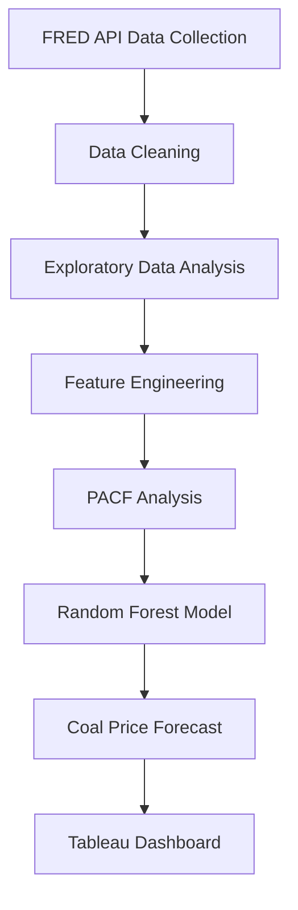
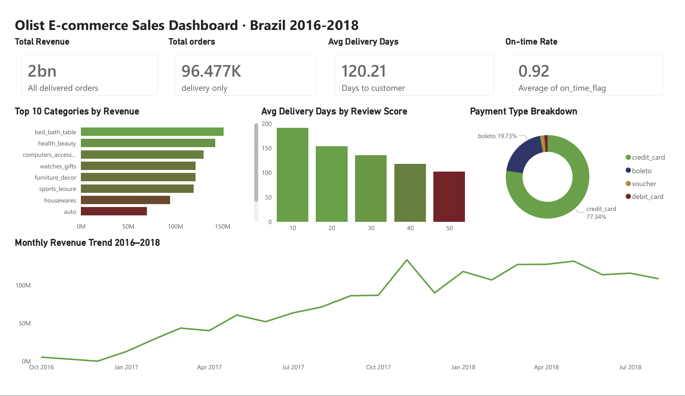

# Olist E-commerce Sales Analysis

## Overview
Exploratory data analysis of 115,000+ delivered orders from Olist,
Brazil's largest e-commerce marketplace (2016–2018).
Identifies 5 actionable business insights for operations and marketing teams.

## Key findings
- November revenue spikes 2-3× monthly average — Black Friday effect
- Home & bath (bed_bath_table) is the #1 revenue category
- Orders taking 20+ days consistently score 1-2 stars on reviews
- Alagoas (AL) has the worst on-time delivery rate at below 80%
- 90%+ of buyers pay by credit card — installments are standard

## Tools used
Python · pandas · matplotlib · seaborn · Jupyter Notebook

## Project Workflow

## Project structure
- `notebooks/01_data_loading` — load and merge 8 source tables
- `notebooks/02_cleaning` — clean data, engineer new features
- `notebooks/03_eda` — 5 exploratory charts
- `notebooks/04_insights` — full business insights report

## Dashboard Preview

## How to run
1. Clone this repo
2. Download the Olist dataset from Kaggle and place CSVs in data/
3. Run pip install -r requirements.txt
4. Open notebooks in order 01 → 04
